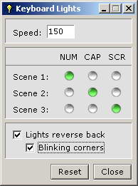



## Keyboard Party Light

### Description

Keyboard Party Lights.

----

Ever thought of having fun with your keyboard lights, if no! then this is it, you can play around with the program with 3 different scene's, and look for keyboard lights(NUM LOCK + CAPS LOCK + SCROLL LOCK) blinking.

Program by Deepak Gurung <deepak_tamu@hotmail.com><deepak.gurung@yahoo.com>
 
### More Info
 
Just some clicks.

Watch keyboard lights.

             |
---                |---
**Submitted On**   |2004-01-27 15:17:36
**By**             |[Deepak Gurung](https://github.com/Planet-Source-Code/PSCIndex/blob/master/ByAuthor/deepak-gurung.md)
**Level**          |Intermediate
**User Rating**    |4.3 (17 globes from 4 users)
**Compatibility**  |VB 6\.0
**Category**       |[Miscellaneous](https://github.com/Planet-Source-Code/PSCIndex/blob/master/ByCategory/miscellaneous__1-1.md)
**World**          |[Visual Basic](https://github.com/Planet-Source-Code/PSCIndex/blob/master/ByWorld/visual-basic.md)
**Archive File**   |[Keyboard\_P1736284222004\.zip](https://github.com/Planet-Source-Code/deepak-gurung-keyboard-party-light__1-53316/archive/master.zip)

